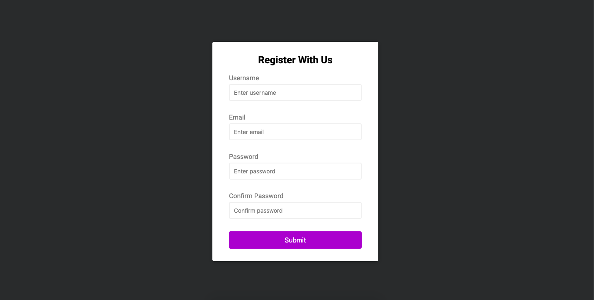

  

<h5>

Simple client side form validation.

  

#### Project Specification

- [x] - Create from UI
- [x] - Show error messages under specific inputs
- [x] - checkRequired() to accept array of inputs
- [x] - checkLength() to check min and max length
- [x] - checkPasswordsMatch() to match confirm password

## Author

**Maisa Maximo**

|  |
| --------------------------------------------------------------------------------------------------------------- |

[LinkedIn](https://www.linkedin.com/in/maisa-maximo-ferreira/)

## Show your support

Give a ⭐️ at this project!
